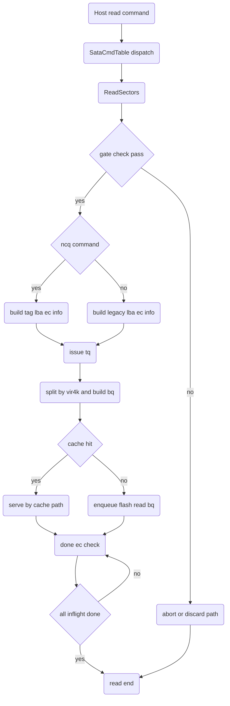
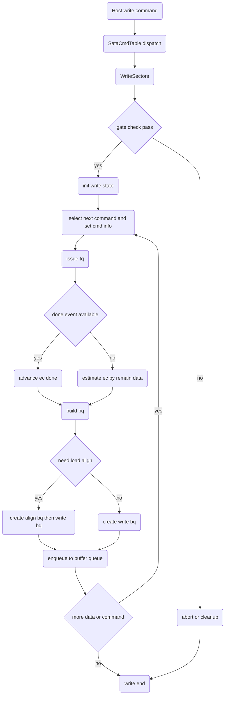
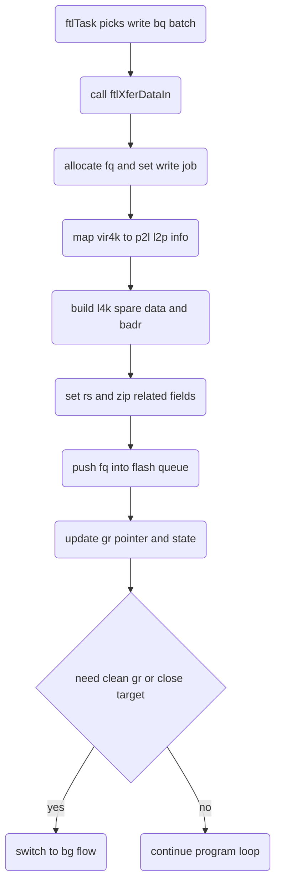
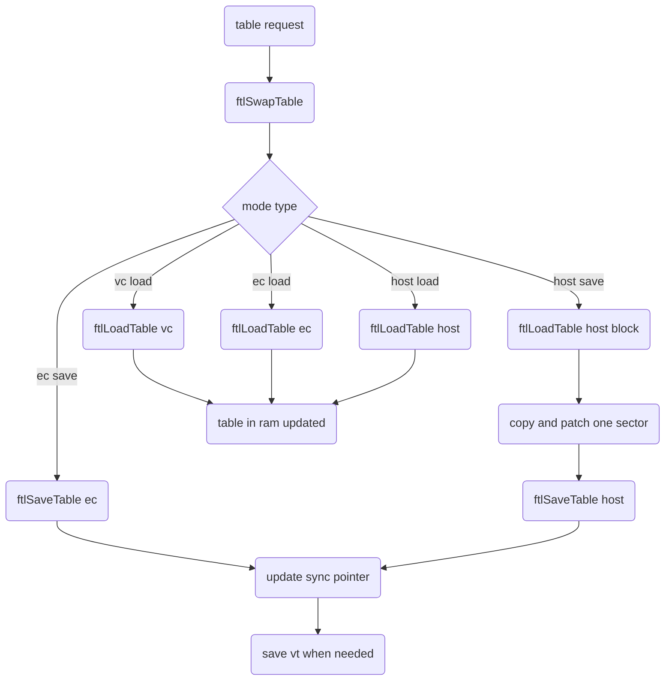
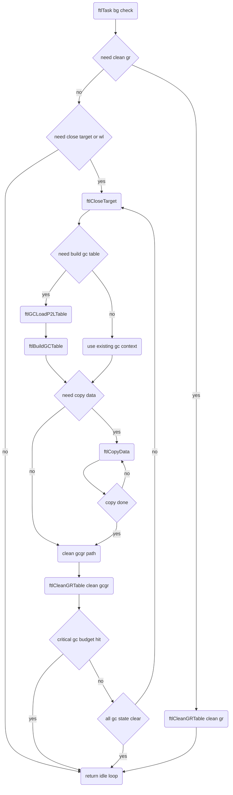

# S11 FTL 架構總覽

## 文件目的
本文件整理 `src/ftl.c` 為核心的 FTL 執行架構，並串接 `src/RW.c` 的 Host Read 與 Host Write 入口，說明以下五條主流程的進入方式與流程控制：

- read
- write
- program
- table
- gc

重點放在「誰觸發」「在什麼狀態下切換」「如何收斂完成或進入例外清理」。

---

## 1. 總體執行架構

### 1.1 Host 命令入口
Host 端由 `SataCmdTable` 將 ATA opcode 導向 command handler：

- 讀命令進入 `ReadSectors` 或 `ReadMultiple`
- 寫命令進入 `WriteSectors` 或 `WriteMultiple` 或 `WriteSectorFUA`

完成前端解析後，資料工作會被轉成 BQ，交給 FTL 背景主迴圈處理。

### 1.2 FTL 背景主迴圈
`ftlTask` 是核心調度器：

1. 先處理 BQ 佇列
2. 若有可組的寫資料，呼叫 `ftlXferDataIn` 送成 FQ 實體工作
3. 若 BQ 為空且狀態旗標要求背景工作，進入 `ftlCleanGRTable` 或 `ftlCloseTarget`
4. 必要時觸發 table 同步 `ftlSwapTable`

也就是說，read 或 write 的 host command 不會直接做全部 NAND 工作，而是透過 BQ 與 FTL 主迴圈解耦。

---

## 2. read 流程

### 2.1 進入方式
- `SataCmdTable` 的 read opcode 進入 `ReadSectors`
- `ReadMultiple` 驗證條件後也會導向 `ReadSectors`

### 2.2 流程控制重點
`ReadSectors` 會做：

1. 前置 gate 檢查
   - security
   - sanitize
   - NCQ 能力
   - reset 或 link lost
2. NCQ 與 non NCQ 參數建構
3. 依 LBA 範圍建立 TQ 與 BQ
4. 命中 cache 直接回應，或建立 flash 讀 BQ
5. 透過 done 機制回收完成 EC，直到 in flight 讀請求清空

### 2.3 Read Flow

---

## 3. write 流程

### 3.1 進入方式
- `SataCmdTable` 的 write opcode 進入 `WriteSectors`
- `WriteMultiple` 檢查後導向 `WriteSectors`
- `WriteSectorFUA` 也會導向 `WriteSectors`

### 3.2 流程控制重點
`WriteSectors` 主要控制：

1. 前置條件檢查與保護模式判斷
2. 建立 `WR_NCQ_CMD_INFO`
3. 先送 host tq，再依完成度轉成 bq
4. 非對齊寫入可先走 load align bq
5. 回收 done tag，更新已可下放的 ec
6. 異常時走 discard 冗餘命令路徑

### 3.3 Write Flow

---

## 4. program 流程

### 4.1 進入方式
program 在本專案不是 host command 直接入口，而是由 FTL 在消化 write bq 時觸發：

- `ftlTask` 在可組成一個 plane 工作時呼叫 `ftlXferDataIn`

### 4.2 流程控制重點
`ftlXferDataIn` 會：

1. 依 GR target 與 plane 計算 FQ 位置
2. 組 `FlashQueue` 工作，設定 `BYTE_FJOB_WRITE`
3. 建立每個 4k 的 L4K spare 內容
4. 更新 GR table 與 L2P 對應資訊
5. 將 FQ 送入 flash pipeline
6. 更新 program 計數與狀態旗標

此流程是 write path 真正落到 NAND program 的關鍵節點。

### 4.3 Program Flow

---

## 5. table 流程

### 5.1 進入方式
table 流程由兩種事件進入：

1. 主動同步
   - `ftlTask` 看到 `gSwapHostTable` job 時呼叫 `ftlSwapTable`
2. 讀寫流程間接需求
   - `ftlSwapTable` 內依 mode 呼叫 `ftlLoadTable` 或 `ftlSaveTable`

### 5.2 流程控制重點
`ftlSwapTable` 以 mode 控制：

- `BYTE_EC_Save_Mode` 保存 EC table
- `BYTE_HOST_Save_Mode` 先確保同步，再 load host table block，修改後 save
- `BYTE_VC_Load_Mode` 與 `BYTE_EC_Load_Mode` 讀回 VC 或 EC
- `BYTE_HOST_Load_Mode` 讀 host table 到暫存

`ftlLoadTable` 會建立 table 專用 FQ read job，必要時 wait result；`ftlSaveTable` 則做 table 寫入與 metadata 更新。

### 5.3 Table Flow

---

## 6. gc 流程

### 6.1 進入方式
gc 由 FTL 背景狀態旗標驅動：

- `ftlTask` 發現 BQ 為空或可切換背景工作
- 若 `btNeedCleanGR` 設定，進入 `ftlCleanGRTable`
- 若 `btNeedCloseTarget` 或 `btNeedWearLeveling` 設定，進入 `ftlCloseTarget`

### 6.2 流程控制重點
`ftlCloseTarget` 是 gc 主流程控制器，包含：

1. 前段清理或補齊 clean gr
2. 若需要 copy data，呼叫 `ftlCopyData`
3. copy 完後切到 clean gcgr
4. 透過 `ftlCleanGRTable` 清除 GR 或 GCGR
5. 建立或重建 gc table
   - `ftlGCLoadP2LTable`
   - `ftlBuildGCTable`
6. 在 critical gc 模式可用時間片方式迴圈執行

### 6.3 GC Flow

---

## 7. 五條流程之間的關係

- read 與 write 是 host command 正向入口
- program 是 write bq 下放後的實體寫入階段
- table 是 metadata 的載入與同步層
- gc 是背景資源回收與搬移層

整體控制核心在 `ftlTask`：

1. 先保證前景資料路徑可前進
2. 再利用空檔推進 clean gr 與 gc
3. 把 table 同步與狀態保存穿插在前景與背景流程之間

