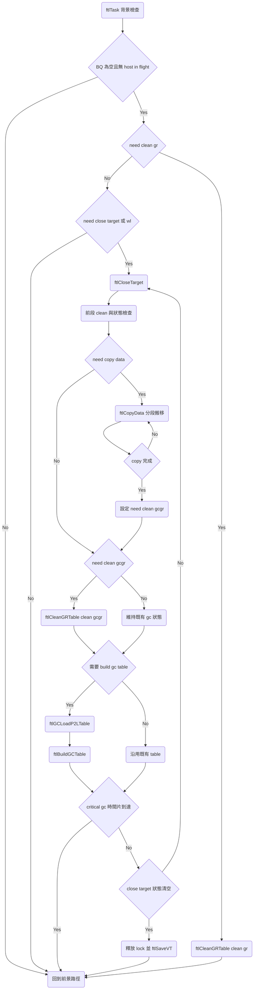

# S11 FTL GC Flow

## 文件目的
本文件整理 S11 韌體中「GC 與 Wear Leveling」主流程，聚焦 `ftlTask` 背景排程如何進入 `ftlCloseTarget`，以及 `ftlCloseTarget` 內部如何在 `ftlGCLoadP2LTable`、`ftlCopyData`、`ftlCleanGRTable` 之間切換，直到回收完成並清除 GC 狀態。

> 範圍：以 `ftlCloseTarget` 主控流程為核心，補上 `ftlCleanGRTable` 觸發 Build GC Table 的關鍵分支。細部 FQ 組法與每個 fail handle 分支不在本文件主路徑。

---

## 1 入口：背景排程進入 GC

`ftlTask` 在 BQ 為空且沒有 host read write in flight 時，會檢查 FTL 背景旗標：

1. 若 `btNeedCleanGR` 設定，優先走 `ftlCleanGRTable`。
2. 若 `btNeedCloseTarget` 或 `btNeedWearLeveling` 設定，進入 `ftlCloseTarget`。
3. `BIT_Finish_In_One_Time` 模式下，會在迴圈中反覆呼叫 `ftlCloseTarget`，直到 close target 狀態清空。

這代表 GC 啟動點不是 host command，而是背景調度條件達成後由 `ftlTask` 推進。

---

## 2 ftlCloseTarget 主控邏輯

`ftlCloseTarget` 是 GC 與 WL 的狀態機控制器。流程可拆成四段。

### 2.1 前段 clean 與狀態檢查

- 進入函式後先判斷 `BIT_Build_GCTable` 與 `BIT_Finish_In_One_Time`。
- 在非 TLC 或指定條件下，先呼叫 `ftlCleanGRTable(ubMode)` 做前段 clean。
- 若 `btNeedCloseTarget` 與 `btNeedWearLeveling` 都清空，直接結束本輪。

### 2.2 CopyData 分支

當 `btNeedCopyData` 設定且目前不在 clean GCGR 階段：

1. 依條件決定先做 `ftlFlushD1` 或直接做 `ftlCopyData`。
2. `ftlCopyData` 會依 `gulCopyBoundary` 分段搬移，避免一次做完整個 target。
3. 當 `VT->gubGCGRTargetIndex == VT->gubGCGRTargetNum`，表示 copy 完成：
   - `btNeedCopyData = 0`
   - `btNeedCleanGCGR = 1`
   - 之後切到 clean GCGR 分支。

### 2.3 CleanGCGR 分支

當 `btNeedCleanGCGR` 設定時：

- 呼叫 `ftlCleanGRTable(BIT_CleanGCGR | ubFinishInOneTime)`。
- 此階段會回收 GCGR table 與相關 search table，並在條件成立時準備下一輪 GC table。

### 2.4 迴圈與結束條件

- 若 `BIT_CRITICAL_GC` 設定，`ftlCloseTarget` 會受時間片限制，達到 budget 可先返回外層。
- 最後會清掉一組 GC 狀態欄位，例如 `btNeedWearLeveling`、`btNeedCopyData`、`gubBuildGCTable`、`gubPartialCloseTargetDoing`。
- 釋放 L2P lock 並 `ftlSaveVT`，結束本輪 close target。

---

## 3 ftlCleanGRTable 與 Build GC Table 關鍵路徑

`ftlCleanGRTable` 同時處理三種模式：

1. `BIT_CleanGR`
2. `BIT_CleanGCGR`
3. only build gc table

關鍵控制點如下：

1. 先依 mode 選擇 `CleanGroups`、`SearchTable`、`P2LTable` 指標來源。
2. 在 `Mark_Load_P2L_For_GC_WL` 判斷 free block 與旗標，必要時觸發 GC 或 WL 的 table 準備。
3. `gubBuildGCTable` 成立時，進入 `Mark_Build_GCTable`：
   - 初始化 `gulGCGRTable` 與 `GCGRSearchTable`
   - 設定 `gubPartialCloseTargetDoing = 1`
   - 配置 `VT->guwGCGRTarget[]`
   - 擇需要時呼叫 `ftlGCLoadP2LTable` 與 `ftlBuildGCTable`
4. Build 完成後回到 close target 狀態機，進入 copy data 或 clean GCGR 階段。

---

## 4 ftlCopyData 搬移資料主線

`ftlCopyData` 主要任務是把 victim unit 的 valid data 搬到 GCGR target。

1. 依 `guoGCTable` 掃描 valid entry，聚合同 unit 同 plane 的連續區段。
2. 建立 read FQ，將資料讀到 copy buffer。
3. 等待 read check done 後建立 write path，將資料 program 到 `VT->guwGCGRTarget`。
4. 更新 spare valid 與 L2P 對應資訊。
5. 推進 `VT->gulGCGRTargetPTR` 與 `VT->gubGCGRTargetIndex`，直到本輪 target 完成。

此函式是 GC 搬移資料的實作核心，而 `ftlCloseTarget` 是它的節奏控制器。

---

## GC Flow Mermaid 圖

---

## 備註

- GC 主路徑可視為三段輪轉：build table、copy data、clean gcgr。
- `ftlTask` 只負責挑選時機，真正狀態轉換集中在 `ftlCloseTarget`。
- 若後續要再拆文件，建議下一份聚焦 `ftlCopyData` 的 read write FQ 細節與錯誤處理。
