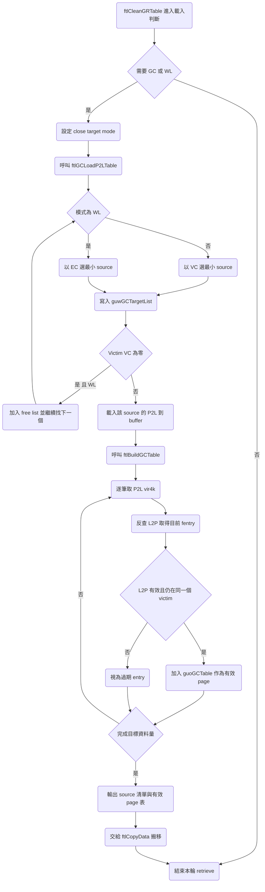

# S11 FTL GC Retrieve Flow

## 文件目的
本文件補齊 S11 韌體中 GC retrieve 的核心流程，聚焦三件事：

1. 如何挑選 GC source 單元
2. 如何同時考慮 VC 與 wear leveling
3. 如何從 P2L 與 L2P 比對找出仍然有效的 page

本文以 `ftlCleanGRTable` 觸發的 `ftlGCLoadP2LTable` 與 `ftlBuildGCTable` 主路徑為基準。

---

## 1 入口與模式決策

GC retrieve 不是由 host 指令直接觸發，而是背景流程在 `Mark_Load_P2L_For_GC_WL` 判斷是否需要 GC 或 WL，接著設定 `gubCloseTargetMode` 後呼叫 `ftlGCLoadP2LTable`。

- 若 free block 壓力達門檻，設定 `ubNeedGC`，進入 GC 模式
- 若 `btNeedWearLeveling` 成立，進入 WL 模式
- GC 模式下若有 open GR target，會用 `BIT_GC_OPEN_P2L_STATIC` 保證它先被納入候選

這一段是 retrieve 的前置條件，決定後續是「偏向最小 VC 回收」還是「偏向最小 EC 平衡壽命」。

---

## 2 如何篩選 GC source

`ftlGCLoadP2LTable` 會反覆建立 `guwGCTargetList`。每輪挑到一個 victim 後，暫時把該單元的 VC 或 EC 設成 Default，避免重覆被選到。

### 2.1 一般 GC 以最小 VC 為主

在非 WL 模式下，source 選擇優先序是：

1. 若有 backup 清單且條件相符，先沿用前輪候選
2. 若有 open GR static 條件，先放 open target
3. 否則用 Search Engine 對 `gulVC` 做 min search，取最小 valid count 單元

如果最小 VC 已經是 Default 或遇到零 VC 邊界條件，會停止或切換到 close target 結束邏輯，避免把不該直接釋放的 case 誤判成可回收集合。

### 2.2 WL 以最小 EC 為主

在 WL 模式下，victim 由 `M_Get_Minimum_UsedUnit_EC` 取得，條件是：

- 該單元 VC 不是 Default
- 該單元 EC 不是 Default

這代表 WL retrieve 的核心不是先追最小 VC，而是先挑低磨耗單元，把較冷資料搬走來拉近整體 erase count 分布。

### 2.3 零 VC 與 free list 特別處理

WL 模式遇到 VC 為零的單元時，不會繼續 build copy table，而是直接放到 `guwFreeUnitList` 候選釋放。這讓 WL 可快速釋放已無有效資料的單元，同時把主要 copy 成本留給真正有資料的 victim。

---

## 3 怎麼同時考慮 VC 與 wear leveling

雖然 GC 與 WL 是兩種模式，但在 retrieve 階段兩者會共用同一套框架，只是評分基準不同。

1. 進入 `ftlGCLoadP2LTable` 前，會先 backup 並遮罩 GR target 或既有 GCGR target 的 VC 或 EC，避免目前正在寫入或已選中 target 參與 victim 競爭
2. GC 模式以 VC 排序挑 source，目標是最小化搬移量
3. WL 模式以 EC 排序挑 source，目標是拉平壽命
4. 結束前再把 backup 的 VC 或 EC 寫回，確保統計值一致

另外在計算 `VT->gubGCGRTargetNum` 時，若是 WL 模式會強制至少一個 target，並額外計算 `gubWLDirectCopy`。當來源資料量相對 target 容量太高時，會切換 direct copy 相關策略，避免 table 無效項目持續膨脹。

---

## 4 如何判定哪些 page 是有效資料

source 挑完後，`ftlBuildGCTable` 會從 `gubGCP2LBuffer` 逐筆掃描 P2L entry，並透過 L2P 反查確認有效性。

### 4.1 先從 P2L 拿到 logical 位置

每筆 entry 先取 `ulVir4kIndex`，再讀當前 L2P group 對應項目。

### 4.2 用 L2P 反查是否仍指向同一個 victim 單元

`M_ACC_PARSE_L2P` 解出 `ulL2PEntry` 後，檢查兩件事：

- L2P 不是 invalid
- `ulL2PEntry / gul4kEntrysPerUnit` 等於目前 victim 單元

兩者都成立才算有效 page，才會組成 `GCTable_t` 進入後續 copy 流程。

### 4.3 無效 page 的處理

若比對失敗代表該 P2L 記錄已過期，可能是資料早就被新寫入覆蓋到其他單元。這種 entry 不會加入 GC table。

在 `gubWLDirectCopy` 條件下，程式還會把該 P2L 項目的 vir4k 直接改成 invalid，縮小後續重複掃描成本。

---

## 5 Retrieve 輸出與後續銜接

retrieve 階段完成後，會得到三個關鍵結果：

1. `guwGCTargetList` 與 `gubGCTargetListNum`，描述本輪 source 清單
2. `gulP2LTableStartIndex`，描述每個 source 對應的 P2L 範圍
3. `guoGCTable`，描述已驗證有效的搬移資料項目

後續 `ftlCopyData` 就依 `guoGCTable` 把有效 page 搬到 `VT->guwGCGRTarget`，完成 GC retrieve 到 copy 的銜接。

---

## GC Retrieve Mermaid 圖

---

## 備註

- 本文件聚焦 retrieve 與 valid page 判定，未展開 `ftlCopyData` 的 FQ 佈局細節。
- 若下一份文件要深化，建議拆成 WL direct copy 條件與 `ftlWLReBuildGCTable` 重建分支。
