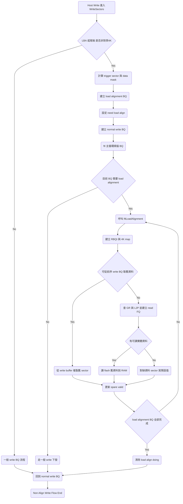

# S11 FTL Non Align Write Flow

## 文件目的
本文件聚焦在 Host 寫入非對齊 4K 資料時，S11 FTL 的處理路徑。內容依照程式流程說明：

- `WriteSectors` 如何判斷需要 load alignment
- 如何分配 write buffer 與建立 BQ
- 何時先做讀舊資料
- 舊資料如何與新資料合併後再進入一般寫入

> 範圍以 `src/RW.c` 與 `src/ftl.c` 的主流程為主，重點在 non align write 相關邏輯。

---

## 1 入口與 non align 判斷

`WriteSectors` 在主迴圈處理每一段可下放資料時，先依 `ulLBA` 與 `ulSectorCnt` 判斷是否有 4K 邊界未對齊。

- 若起始 LBA 非 4K 對齊，會把本次觸發長度限制到本 plane 可處理範圍，並設定 `ubNeedLoadAlign = 1`。
- 若起始對齊但尾端不是 4K 對齊，也會設定 `ubNeedLoadAlign = 1`。
- 同步計算 `ulTriggerSectorCnt` 與 `ub4kNum`，並生成 `ulDataMask`，讓每個 4K 都有對應的 sector 有效位元。

`ulDataMask` 的意義是「這次 Host 寫入真正覆蓋到哪些 sector」，後面 merge 就靠它決定哪些資料要保留舊值、哪些要用新值。

---

## 2 WriteSectors 建立兩種 BQ

當 `ubNeedLoadAlign = 1`，`WriteSectors` 會建立兩個連續的 write BQ：

1. load alignment BQ
   - `btNeedLoadAlign = 1`
   - `ulDataMask` 取反，代表「需要補舊資料」的區域
2. normal write BQ
   - `btNeedLoadAlign = 0`
   - `ulDataMask` 保持原值，代表 Host 新資料區域

兩個 BQ 共用同一段 vir4k 與 buffer 區間概念，但角色不同：

- load alignment BQ 先把舊資料補齊
- normal write BQ 再把本次 Host 資料送入正式寫入管線

這是非對齊寫入的核心拆分方式。

---

## 3 write buffer 分配方式

在 non DDR write buffer 路徑中：

- `BQ->uwBufferIndex` 會以 4K 邊界對齊，若目前 `uwBufferPTR` 有 sector offset，會先對齊到 4K 起點。
- normal write BQ 完成建構後，`uwBufferPTR` 依 `ulTriggerSectorCnt` 前進。
- `ub4kTransferDone` 與 write buffer window 計數同步更新，用來限制 TQ 到 BQ 的節奏。

同時，若啟用 keep BQ 機制，流程會嘗試暫存某些 load alignment BQ 或 write BQ，等待更好的合併時機再釋放，以降低碎片化。

---

## 4 ftl 主循環如何啟動 load alignment

在 `ftl` 的 BQ 處理主循環內，遇到 write BQ 且 `btNeedLoadAlign = 1` 時：

- 若該 BQ 還沒有 RBQI，會呼叫 `ftlLoadAlignment`。
- 進入 `ftlLoadAlignment` 後，先把 `gubLoadAlignDoing` 設為 1，表示目前在執行非對齊補資料流程。
- 依 BQ 的 `ulDataMask` 建立 `ub4kInBQMap`，只追蹤需要補舊資料的 4K。

這裡的 RBQI 是 load alignment 的狀態機容器，記錄每個 BQ 的搜尋 GR、載入 table、載入舊資料等階段。

---

## 5 舊資料來源選擇與合併

`ftlLoadAlignment` 在 `BYTE_BQR_Load_Data` 階段，對每個需要補資料的 4K 逐一處理，策略如下。

### 5.1 先嘗試從前序 write BQ 複製

若 `ubNeedLoadAlignCopyFromWB` 對應 bit 被設為 1，表示可從前序 linked write BQ 取得同一 vir4k 的舊資料：

- 透過 `ubLoadAlignSrcLink` 與 `ubLoadAlignSrcLinks4kIndex` 找到來源 BQ 與來源 4K。
- 以 `ulDataMask` 指定的 sector 範圍逐 sector 做 `mDMAC_COPY`，把舊值複製到目前 destination buffer。

此路徑可避免額外 flash read，降低延遲與讀放大。

### 5.2 若 WB 沒命中則讀 GR 或 L2P 對應的 flash

若無法從 WB 複製，會走資料映射查詢：

- 先看 GR hit map 與 special data map。
- 命中可讀實體頁時，建立 read FQ 讀回舊資料到對應 RAM 位置。
- 若對應不存在或可視為空值，走 set value 路徑，對指定 sector 寫入預設值。

這段結束後會更新 `BQ->ulSpareValid`，表示哪些 sector 的舊資料已經補齊且可用。

---

## 6 merge 完成後回到一般寫入

當一批 load alignment BQ 所需 read FQ 都進入可檢查狀態，`ftlLoadAlignment` 會等待 check done 並整合 spare valid。

完成條件滿足後：

- 對應 load alignment BQ 進入 done 階段
- `gubLoadAlignDoing` 清為 0
- 回傳到 ftl 主循環，接續處理後面的 normal write BQ

因此整體順序是：

1. 先補舊資料
2. 再下發一般 write 資料
3. 最終組成完整 4K 內容送往後端 program

---

## Non Align Write Mermaid 圖

---

## 備註

- non align write 不是單一路徑，而是 `WriteSectors` 與 `ftlLoadAlignment` 的協同流程。
- `ulDataMask` 是 merge 的核心資訊，決定每個 4K 中哪些 sector 由舊資料補齊，哪些 sector 採用 Host 新資料。
- 若前序 write BQ 已有可用舊資料，系統會優先採用 WB copy，減少 flash read。
