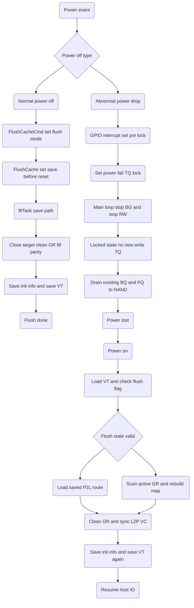
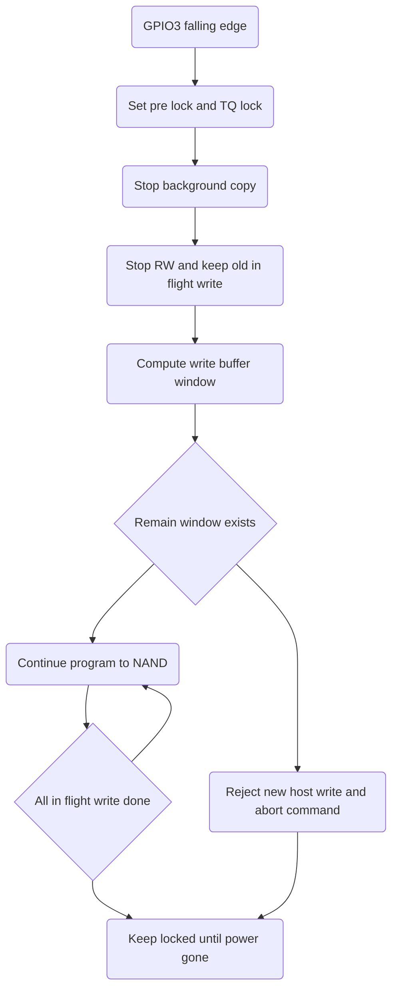

# S11 FTL Power Fail Flow

## 文件目的
本文件整理 S11 韌體在兩種掉電情境的流程：

- 正常斷電：Host 發出 Flush 或 Standby 類命令，韌體主動進入保存流程。
- 異常斷電：GPIO3 power fail 訊號觸發後，韌體進入搶救寫入視窗並鎖住新寫入。

重點放在「正在進行中的寫入流程如何收斂」、「尚未持久化資料如何盡快寫到 NAND」、「復電後如何復原映射與資料」，以及「不穩定 NAND 資料的救援策略與可容許遺失上限」。

---

## 1 正常斷電流程

### 1.1 觸發點

正常斷電通常來自 ATA Flush 或 Standby 命令，入口在 `FlushCacheCmd` 與 `FlushCache`：

- `FlushCacheCmd` 依模式設定 `gubFlushMode`。
- `FlushCache` 在 `BYTE_STANDBY_FLUSH` 或 `BYTE_SATASTANDBY_FLUSH` 時，會設 `gubSavingEveryThingBeforeReset = 1`，並等待 FTL 把狀態保存完成。

### 1.2 FTL 保存主路徑

當 `gubSavingEveryThingBeforeReset = 1`，`ftlTask` 會優先收斂背景工作並進入保存路徑：

1. 優先完成或停止 BG copy 與 close target。
2. 若 active GR 尚未完整，會先補齊 share page 或將 GR 填滿到可安全保存的狀態。
3. 需要時先完成 table parity 編碼，再保存 init info。
4. 保存 VT，最後清掉 flush 狀態與 `gubSavingEveryThingBeforeReset`。

這條路徑的目的是在「可控斷電」前把 L2P table metadata、GR 關聯、VT 狀態等關鍵資訊落盤，讓下次上電不用走高風險的全域重建。

---

## 2 異常斷電流程

### 2.1 觸發點與第一時間動作

異常斷電由 GPIO3 falling edge 觸發，在 `GPIO_DEVSLP_ISR` 會立即做三件事：

1. `gubPfail_state = PFAIL_STATE_PRE_LOCK`
2. `gBQI.ubWrite_TQ_lock |= POWER_FAIL_TQ_LOCK`
3. 重新計時 `gulPfail_time`

`POWER_FAIL_TQ_LOCK` 的核心作用是「禁止後續新寫入 TQ 進來」，把剩餘電力全部留給已進入 pipeline 的資料。

### 2.2 main loop 的 pfail 狀態轉換

在 `mainTask`，偵測到 `PFAIL_STATE_PRE_LOCK` 會：

1. 停止 BG copy。
2. 呼叫 `HandleStopRW(1)`，快速排空現有 BQ/FQ。
3. 設 `gubPfail_state = PFAIL_STATE_LOCKED`。

此外在 pfail 期間，`gubFTLNoWait` 會被打開，使 FTL 不再等待非必要 cache read write 互鎖，優先搶時間完成寫入落盤。

### 2.3 Write path 的緊急收斂策略

`WriteSectors` 與 `ftl_cal_write_buffer_window` 在 `ENABLE_PFAIL` 下有兩個關鍵保護：

- **寫入視窗限制**：`gBQI.uwWrite_buffer_window` 會依目前 GR plane 位置與 parity 區域動態縮小，接近關鍵區時可降到 1 個 plane。
- **TQ 鎖定後拒收新命令**：若偵測 `POWER_FAIL_TQ_LOCK`，當前尚未安全進入 BQ 的命令會走 abort 清理，避免擴大未持久化範圍。

簡單說：異常斷電時不是「盡量接更多 host data」，而是「立刻封口，盡快把已接收資料寫完」。

---

## 3 復電後的復原流程

### 3.1 從 VT 與 flush 狀態判斷恢復模式

初始化流程在 `ftlinit.c` 會先檢查：

- `VT->gulFTLState.B.btFlushCache`
- `VT->guwGRLastP2LPTR`
- active GR 與 table 的 RS 狀態

若上次有完整 flush 紀錄，會優先載入已保存的 P2L 路徑；若沒有，會進入掃描 active GR 的較重流程。

### 3.2 掃描 active GR 與重建映射

`Mark_ScanActiveGR` 會以 FQ 逐 plane 掃描 active GR：

1. 讀取資料與 spare。
2. 用 RS 相關欄位校驗與修正。
3. 重建 GR table 與 L2P 關聯。
4. 將需要 clean 的條目交由 `ftlHandleGRTable` 和 `ftlCleanGRTable` 做收斂。

接著在 `ftl.c` power cycle 流程中，會依是否已 copy active GR、是否需要 clean GRT、是否要切換新 GR target，去保存 init info 與 VT，最後回到可服務狀態。

---

## 4 不穩定 NAND 資料救援策略

### 4.1 救援方法

對於「已寫到 NAND 但讀取不穩定」的資料，初始化與一般讀流程都會使用 retry 與 RS 路徑：

- 讀取階段使用 `BIT_FJOBI_RETRY` 和 `BIT_FJOBI_RS`。
- 若仍有錯誤 frame，後續可進入更深層的 SoftBit 或 RS recover 流程。

這代表復電後不只做 metadata 恢復，也會對邊緣資料頁做最大化可讀性的救援。

### 4.2 救援邊界

若頁面超出 ECC 或 RS 可修正能力，流程會保留錯誤標記並進入 fail log，該部分資料視為不可救援。實作上策略是「盡量把可修部分救回，無法修的最小化範圍隔離」。

---

## 5 最大可容許資料遺失量

此專案在 `ENABLE_PFAIL` 下，直接用 write window 控制掉電風險上限：

- `BUFFER2_WRITE_WINDOW_4KNUM` 定義為可在電容能量內安全完成的最大 write EC。
- `BUFFER2_WRITE_NUM` 在 `ENABLE_PFAIL` 會縮小成 `(BUFFER2_NUM - BUFFER2_Read_NUM) / 8`。
- 以目前預設值來看，對應到約 16 KB 的 host write 緩衝視窗上限，且在接近 parity 關鍵區可被動態降得更小。

因此「最大容許掉資料」應解讀為：

- 上限是當下仍在 DRAM 或尚未完成 NAND program 的 write window 範圍。
- 不是整個 command queue。
- 實際可遺失量會隨當下 GR plane 位置與 parity 狀態縮小，最壞情境通常小於等於該 window 上限。

---

## Pfail Flow Mermaid 圖

---

## 異常斷電資料救援細圖

