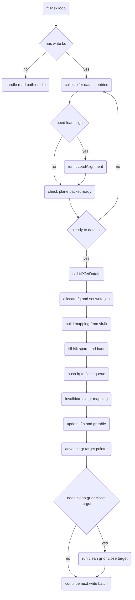

# S11 FTL Program Flow

## 文件目的
本文件整理 S11 韌體中「FTL Program」主流程，描述資料如何從 write BQ 進入 `ftlTask()`，再由 `ftlXferDataIn()` 建立 FQ write job，最後完成 GR table 與 L2P 對應更新。

> 範圍：本文件聚焦在 user data 的 Data In Program 路徑，不展開 table save 與完整 GC 細節。

---

## 1 入口與觸發條件

Program 不是 ATA command 直接進入，而是由 `ftlTask()` 在背景主迴圈中處理 BQ 時觸發。

核心判斷如下：

1. 若 `gBQI.ubLinkNum` 不為零，`ftlTask()` 會掃描 BQ queue。
2. 遇到 write BQ 時，會把每個 4K 的 `ubToDoLink`、`ulVir4kIndex`、`uwBufferIndex`、`ubSectorNum` 組成 `XferDataIn[]`。
3. 當累積到一個 plane 的可寫條件，或遇到 forced clean，會跳到 `Mark_XferDataIn` 呼叫 `ftlXferDataIn(XferDataIn, ubF4kIndex)`。

這表示 Program 入口本質是「BQ 聚合後送入 FTL data in」。

---

## 2 ftlTask 內的 Program 前置處理

在進入 `ftlXferDataIn()` 前，`ftlTask()` 會先做幾個與 Program 相關的控制：

1. **BQ 類型分流**
   - write BQ 走 data in path
   - read BQ 走 data out path
2. **Load alignment 先行**
   - 若 BQ 需要 `btNeedLoadAlign`，先執行 `ftlLoadAlignment()`，避免未對齊資料直接 program
3. **Plane 封包成形**
   - 透過 `ubFSecCnt` 與 `ubF4kIndex` 控制一批 data in 的大小
   - 未滿一批時可填 dummy 4K，確保後段 program job 可送出
4. **背景工作互斥**
   - 當 queue 為空或條件成立時，才會穿插 `ftlCleanGRTable()` 或 `ftlCloseTarget()`
   - 目的是避免 host write in flight 時過度打斷 data in program

---

## 3 ftlXferDataIn 主流程

`ftlXferDataIn()` 是 Program 核心，主要可分成六段。

### 3.1 建立 FQ write job

- 依 `VT->gulGRTargetPTR` 計算 CE 與 FQ link。
- 設定 `FQ->ubFJob = BYTE_FJOB_WRITE`。
- 設定 `FQ->uwFUnit`、`FQ->ulFEntry`、`FQ->ubL4kNum`、`FQ->uwFJobInfo`。

### 3.2 轉換 XferDataIn 成 mapping

對每個 4K：

- 將 vir4k 與 z byte 記錄到 `ulMapping[]`。
- 標記 `NEED_UPDATE_L2P`，代表後續要更新 L2P。
- 若同一個 BQ 連續 4K，vir4k index 會走連續遞增。

### 3.3 產生 L4K spare 與資料位址

逐筆填入 L4K table：

- `ulL4K_LCA`
- `ubL4K_SPRV`
- `ubL4K_ZCODE`
- `ulL4K_BADR`
- `ubL4K_FW2`

資料來源可能是 SDR cache 或 Buffer2，並依 4K 的來源設定 BADR。

### 3.4 FQ 入列

- 完成 L4K table 後，增加 `gFQI.ubFQLinkNumber` 與 `gFQI.ubFQLinkNumber_W`。
- 代表一筆 write program job 已送進 flash queue pipeline。

### 3.5 清除舊 GR 映射

在 `Mark_ClearOldGR` 階段，若新寫入 vir4k 命中舊資料：

- 會找到舊 GR entry 並標成 invalid。
- 同步維護 GR search link 結構，避免同一 LCA 保留多個有效版本。

### 3.6 更新 L2P 與 GR 指標

- 依新資料更新對應 L2P entry。
- 更新 active GR table 對應欄位。
- 最後推進 `VT->gulGRTargetPTR`，準備下一個 plane 的 program。

---

## 4 Program 與 Clean GR 或 Close Target 的關係

Program 過程不是單一路徑，會與背景流程互動：

1. 若 `btNeedCleanGR` 被置位，`ftlTask()` 會在適當時機呼叫 `ftlCleanGRTable()`。
2. 若 `btNeedCloseTarget` 或 wear leveling 條件成立，會呼叫 `ftlCloseTarget()`。
3. `ftlXferDataIn()` 推進 `GRTargetPTR` 後，可能觸發上述旗標，形成「寫入一段再做背景回收」的節奏。

這種設計可在 host write 延遲與 free block 健康度之間做平衡。

---

## Program Flow Mermaid 圖

---

## 備註

- 本流程是控制流視角，重點是 BQ 到 FQ 的轉換與 mapping 更新。
- 若後續需要延伸，可再拆出「close target 子流程」與「clean gr 子流程」兩份文件，與本文件互相連結。
