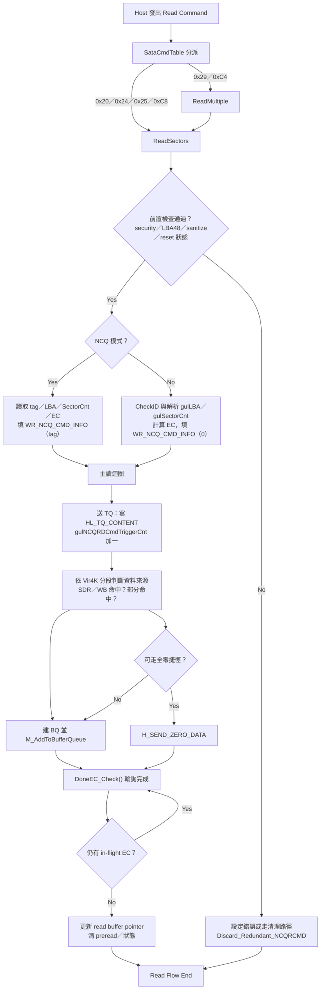

# S11 FTL Read Flow

## 文件目的
本文件整理 S11 韌體中「Host Read」主流程，先從 ATA/SATA command mapping 進入 `ReadSectors()`，再說明 `ReadSectors()` 內如何分流 NCQ / non-NCQ、如何建構 BQ（Buffer Queue）、以及如何透過 `DoneEC_Check()` 回收完成事件（DoneTag / EC）。

> 範圍：以 `ReadSectors()` 主讀路徑為核心，`ReadVerify`/`Read Log` 等特殊讀指令不在本文件主要路徑中。

---

## 1) 入口：Command 到 Read handler

在 `SataCmdTable` 中，常見讀命令會對應到以下 handler：

- `0x20` (`Read Sectors`) → `ReadSectors`
- `0x24` (`Read Sector EXT`) → `ReadSectors`
- `0x25` (`Read DMA EXT`) → `ReadSectors`
- `0x29` (`Read Multiple EXT`) → `ReadMultiple`（內部再呼叫 `ReadSectors`）
- `0xC4` (`Read Multiple`) → `ReadMultiple`
- `0xC8` (`Read DMA`) → `ReadSectors`

其中 `ReadMultiple()` 在基本檢查（security lock / LBA48 / sanitize）通過且 multi mode enable 時，最終也會導向 `ReadSectors()`。

---

## 2) ReadSectors 初始化與前置檢查

`ReadSectors()` 進入後先做幾個關鍵檢查：

1. **RDT/Burner mode gate**：禁止特定模式下執行一般路徑。
2. **Write-protect 特例**：若錯誤單元或初始化失敗導致 write protect，直接走 `SDR_RW_DMA()` return。
3. **命令合法性檢查**：security lock、NCQ capability、LBA48 support、sanitize state。
4. **錯誤中止判定**：若 `gubNCQINTRError / gubHardReset / gubLinkLost`，會把 `gubNeedChkDoneTag = 0` 並跳轉到錯誤清理路徑。
5. **初始化執行狀態**：例如 `uwBufferIndex`、`gubSeqCmdCnt`、`H_TQ_BY_ORDER` 等旗標。

---

## 3) 讀命令參數建立（NCQ vs non-NCQ）

### NCQ 模式
- 讀 `HL_RD_NCQ_INFO` 取得 `ubNCQTag`。
- 從 `NLL[tag] / NSL[tag] / NEC[tag]` 取出 LBA、SectorCnt、EC。
- 將資訊寫入 `WR_NCQ_CMD_INFO[tag]` 作為該 command 的追蹤結構。

### non-NCQ 模式
- 先 `CheckID()`；若失敗就走錯誤清理。
- 由 `gulLBA / gulSectorCnt` 取得本次讀取參數。
- 以 `(sector + 起始 offset)/8` 換算 `uwEC`（4KB 為一個 EC）。
- 寫入 `WR_NCQ_CMD_INFO[0]`，統一後續處理介面。

---

## 4) Read command 主循環：TQ 與 BQ 建構

`ReadSectors()` 主體是在 `while (1)` 迴圈中處理命令，核心動作如下：

1. **預讀（PreRead）與順序讀策略**
   - 透過 `gubPreRead`、`gulPreReadStartLBA`、`gubSeqR` 等條件決定是否開啟/延續 preread。
   - 視需要切換 `H_TQ_BY_ORDER`，確保 queue 送出順序。

2. **送出 TQ（Host 讀傳輸要求）**
   - 計算 buffer pointer 後寫入 `HL_TQ_CONTENT`。
   - `gulNCQRDCmdTriggerCnt++` 代表有新的讀傳輸在飛行中。

3. **依 Vir4K 分段建 BQ（真正 FTL/NAND 讀工作）**
   - 逐段檢查資料來源：
     - 來自 SDR cache / write buffer 命中
     - 部分命中（需「快取拷貝 + flash 補讀」）
     - 全部走 flash
   - 依 case 建立 `BQ`，填入 `ulVir4kIndex`、`ulDataMask`、`ub4kNum`、`btPartialFromFlash`、`ubDataInDRamMap` 等欄位。
   - 呼叫 `M_AddToBufferQueue()` 把 BQ 丟給後端 FTL/Flash pipeline。

4. **全零資料捷徑（zero data）**
   - 在特定條件下檢查 L2P / GR 對應是否全 invalid。
   - 若全零，直接送 `H_SEND_ZERO_DATA`（不經實體 flash 讀），加速回應。

---

## 5) 完成事件回收：DoneEC_Check()

`DoneEC_Check()` 負責消化「已完成 EC」並回收讀 buffer 狀態：

1. **有硬體 DoneTag (`SATAB_RD_CNT`) 時**
   - 讀 `DONETAG` 找到完成命令。
   - 用 `uwEC - uwEC_BQDone` 算出新完成量，清除 `guoFWRead4kBufferFlag` 對應 bit。
   - 更新 `WR_NCQ_CMD_INFO[tag].uwEC_BQDone = uwEC`。
   - `gulNCQRDCmdTriggerCnt--`，表示 in-flight command 減少。

2. **無 DoneTag 時**
   - 走 message/remaining sector 的 fallback 推估已完成 EC。
   - 一樣更新 buffer flag 與 `uwEC_BQDone`。

3. **同時處理併發控制**
   - preread 的 tag 追蹤與尾端對齊。
   - NCQ overlap / `H_TQ_BY_ORDER` 狀態回復。
   - timeout 偵測與 fail log 記錄。

---

## 6) 讀流程收尾與異常路徑

- 在 `while (gulNCQRDCmdTriggerCnt)` 中持續呼叫 `DoneEC_Check()` 直到 in-flight 清空。
- 若 `gubNeedChkDoneTag == 0`（例如 reset/link lost）會走 `Discard_Redundant_NCQRCMD`：
  - 清空/重設 queue 追蹤結構、清 flags、等待 BQ/FQ drain。
- 正常收尾會更新 `guwReadBufferPTR`、必要時清 preread state，最後回到命令主迴圈。

---

## Read Flow Mermaid 圖

---

## 備註

- 這份 flow 是偏「控制流 + queue 互動」視角，目的在協助理解 command 進入點、資料來源分流與完成回收。
- 若下一步要補齊 write/trim/sanitize flow，可沿用同樣模板：**入口命令** → **前置檢查** → **核心 queue 流程** → **完成/異常收尾**。
