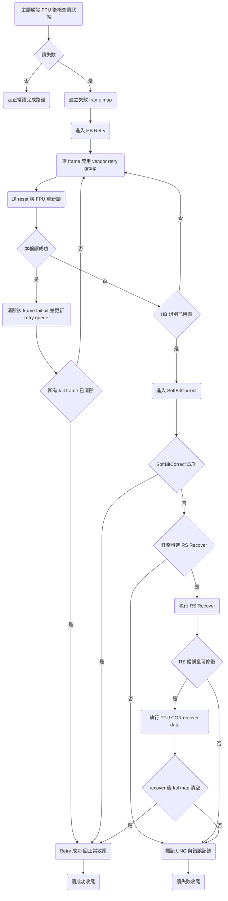

# S11 FTL Retry Flow

## 文件目的
本文件說明 S11 在 NAND 讀取失敗後的修復路徑，聚焦在 `flafail.c` 的讀失敗處理流程。內容分成兩大類：

- **硬體條件調整**：透過 Hard Bit Retry 重新下發讀參數，包含不同 vendor 的 retry group，對應到讀取門檻或參考電壓類型調整。
- **演算法復原**：當硬體 retry 仍失敗時，進一步走 SoftBitCorrect 與 RS recover，最後用 FPU COR 將可恢復資料回填。

> 範圍：以一般 Host Read 命中讀失敗為主線，描述 `flaReadFailHBRetry`、`SoftBitCorrect`、`RS_Recover`、`flaReadFailRetryFPUCORRecoverData` 的串接關係。

---

## 1) 入口與失敗判定

主讀流程在 FPU trigger 後，會先用 `flaReadFailRetryCheckReadStatusInFail` 判斷是否讀失敗。

- **讀成功**：直接回到正常路徑。
- **讀失敗且不是 erase page**：進入 retry 主流程。
- 先抓 `UNC_MAP` 與相關 fail frame 資訊，建立失敗 frame map，作為後續 HB 與 SB 的輸入。

---

## 2) 第一層修復：HB Retry

`flaReadFailHBRetry` 是第一層修復主體，概念是「每次對失敗 frame 重讀，逐組套用 retry 參數」。

### 2.1 HB Retry 的基本動作

1. 初始化失敗 frame map，並切到 `UNC_MAP`、`CRC32_ERR_MAP` 篩出真正需要 retry 的 frame。
2. 逐 frame 處理，每輪先送 reset 命令與重設必要狀態。
3. 依 vendor 與 page type 選 retry group，呼叫對應 flow 設定參數後再觸發 FPU 讀。
4. 若某組參數讀成功，從 fail map 清掉該 frame，並更新 retry queue 順序，讓有效組別更早被嘗試。

### 2.2 調門檻與時序的做法

HB Retry 並不是單純重讀，實作上同時做了幾種「硬體條件調整」：

- **Vendor retry 參數表寫入**：
  - Sandisk 走 `flaReadFailRetrySandiskFlow`。
  - Toshiba 走 `flaReadFailRetryToshibaFlow`。
  - 兩者都會透過 PIO command 寫 retry 參數組到 NAND 內部寄存器，再讀 status 確認。
- **不同 block type 與 page type 分流**：
  - D1 與 D2 D3 使用不同 retry group。
  - 依 lower page 或 upper page 選不同 queue。
- **時脈降速輔助**：
  - retry 前後會調整 `FCTLL_FDIV_CFG`，先降速再回復，降低邊界條件下的讀取錯誤。

實務上可把這層理解成「透過 read retry 參數改變讀取視窗」，常被視為電壓閾值或感測條件重掃。

---

## 3) 第二層修復：SoftBitCorrect

若 HB Retry 後仍有 fail frame，流程進入 SoftBitCorrect：

1. 設定 `gubEnterSB` 進入 SB 階段。
2. 呼叫 `SoftBitCorrect`，輸入包含 fail map 與目前 DMA 緩衝資料。
3. 若成功，視為讀恢復成功並回到正常收尾。
4. 若失敗，保留 fail map，進入下一層 RS recover。

這一層屬於「演算法側補救」，目的不是再調 NAND 讀條件，而是利用多次讀取資訊與解碼策略去還原資料。

---

## 4) 第三層修復：RS Recover 與 FPU COR 回填

若該讀任務具備 RS 條件，會進入 RS recover：

1. `RS_Recover` 先計算可恢復的錯誤平面與錯誤量。
2. 若錯誤量在可處理範圍內，呼叫 `flaReadFailRetryFPUCORRecoverData`。
3. `flaReadFailRetryFPUCORRecoverData` 會：
   - 先做 dummy FPU COR 檢查。
   - 需要時重填 L4K table。
   - 觸發 FPU restore backup 與 FPU COR，將修復資料寫回對應 buffer。
   - 重新檢查 signoff 與 compare 結果，更新最終 fail map。
4. 若 fail map 清空，流程判定 recover 成功；否則進入 UNC 與錯誤紀錄處理。

這層是「進階演算法加上硬體回填」的最終修復階段。

---

## 5) 失敗後處理與資料保護

當 HB SB RS 都無法清掉 fail map 時，流程會：

- 設定 UNC 相關狀態與錯誤位址。
- 依 user data 或背景流程類型標記對應的失敗行為。
- 更新 fail log 與 debug counter，供後續 block 管理與統計使用。

---

## Retry Flow Mermaid 圖

---

## 補充說明

- 所謂「調電壓」在此程式層通常表現為「切換 retry 參數組並重讀」，實際對應 NAND 內部 read reference 設定。
- 「用演算法復原」對應 SoftBitCorrect 與 RS recover，再由 FPU COR 把修復結果回寫到資料路徑。
- 三層策略的設計目標是先用成本較低的硬體 retry，失敗再逐步升級到計算成本較高的演算法復原。
