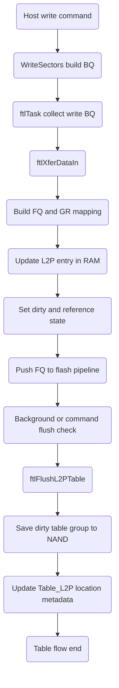
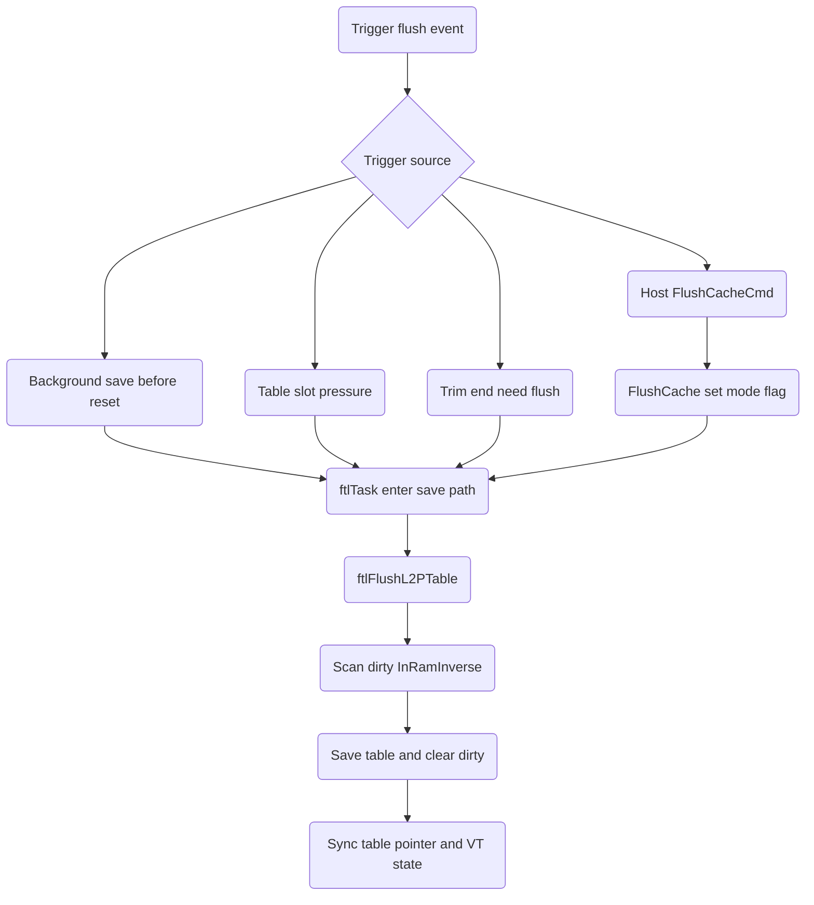
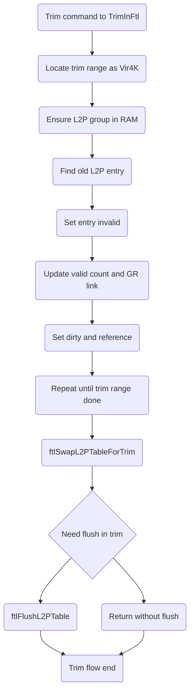

# S11 FTL Table Flow

## 文件目的
本文件整理 S11 韌體中 L2P 相關 table 的分層設計與執行流程，聚焦在下列議題：

- L2P table 分層與名詞
- 各層 table 的映射與管理
- L2P entry 格式
- Host write 後如何更新 L2P
- L2P table 如何 flush 到 NAND
- flush 觸發時機與 Host 強制 flush 行為
- write gc trim 會如何觸發 L2P 更新
- program table 與 update L2P 的順序關係

> 範圍：以 `ftlTask` 背景流程、`ftlXferDataIn`、`ftlFlushL2PTable`、`ftlSwapTable`、`TrimInFtl` 與 `FlushCacheCmd` 路徑為主。

---

## 1 L2P table 有幾層

以程式結構來看，L2P 相關映射可分成三層管理：

1. 映射資料層
   - `L2PTable_t` 為單一 L2P entry，內容是 `ulFEntry` `ubZByteOffset` `ubZByteNum`
   - `gulL2PBase` 是實際 L2P group 資料在 RAM 的承載區
2. 映射索引層
   - `guwL2P_InRamIndex` 從 L2P group index 找到目前在 RAM 的 slot
   - `gulL2P_InRamInverse` 從 RAM slot 反查 group，並管理 dirty valid reference waiting_update 等狀態
3. 持久化定位層
   - `gulTable_L2P` 保存每個 L2P group 在 NAND table 區的位置資訊，例如 `uwFEntry` `ubFUnitIndex`
   - 這一層決定 `ftlLoadTable` 與 `ftlSaveTable` 要從哪裡讀寫 table plane

可把它理解為：

- L2PTable 是內容
- InRamIndex Inverse 是 cache 管理
- Table_L2P 是 NAND 位置資訊

---

## 2 名詞解釋

- Vir4KIndex
  - Host LBA 經 4K 對齊後的邏輯索引，L2P 更新以這個索引定位
- L2P Group
  - 多個 Vir4K entry 的集合，swap 與 flush 以 group 為單位
- P2L Table
  - 實體寫入時的反向映射，記錄本次 program 的 logical 資訊，後續可用來重建或校驗
- GR Table
  - 當前寫入聚合區，收集本輪 data in 的 mapping 與狀態
- Table Unit
  - 專門存放 table 資料的 NAND 單元，`ftlFlushL2PTable` 會把 dirty L2P 寫入此區
- Dirty L2P
  - 某個 L2P group 在 RAM 被更新但尚未保存到 NAND，透過 `gulL2P_InRamInverse.btDirty` 追蹤

---

## 3 各層 table 如何映射與管理

### 3 1 group 進入 RAM

當流程要讀寫某個 Vir4K 對應 L2P group 時：

1. 先用 `guwL2P_InRamIndex[group]` 看該 group 是否已在 RAM
2. 若不在 RAM 或 slot 狀態不可用，呼叫 `ftlSwapL2PTable` 載入
3. 載入完成後，以 `L2PTable = gulL2PBase[slot base]` 取得可直接讀寫的 L2P array

### 3 2 dirty 與替換管理

更新 L2P entry 時，會把對應 slot 設成 dirty 與 reference：

- `gulL2P_InRamInverse[slot].btDirty`
- `gulL2P_InRamInverse[slot].btReference`

這兩個位元在 flush 與 swap 很關鍵：

- dirty 代表需要保存
- reference 代表最近使用，不宜被立即回收

### 3 3 持久化位置追蹤

`gulTable_L2P[group]` 會記錄此 group 最新 table 版本落在哪個 table unit plane。

- load table 路徑用它來找讀取來源
- save table 路徑更新它為新位置
- 這讓 L2P 支援版本前移與背景回收

---

## 4 L2P table 格式

`L2PTable_t` 是 32bit，主要欄位如下：

- `ulFEntry` 26 bit
  - 指向實體 4K entry 基址
- `ubZByteOffset` 3 bit
  - 實體 entry 內 zbyte offset
- `ubZByteNum` 3 bit
  - 代表 4K 內有效 sector 長度資訊

另外 `Table_L2P_t` 不是單筆映射內容，而是某個 L2P group 的 table metadata，包含：

- `uwFEntry` `ubFUnitIndex` 代表 table 在 NAND 的位置
- `ubAllZero_BM` 與 `btNeedCheckAllZero` 代表全零區段追蹤
- `ubIsInGR` 代表目前是否仍在 GR 活動資料裡

---

## 5 Host write 後如何更新 L2P

Host write 進到 `WriteSectors` 後，資料會先形成 BQ，再由 `ftlTask` 聚合並呼叫 `ftlXferDataIn`。

在 `ftlXferDataIn` 的更新重點：

1. 建立本輪 `ulMapping` 與 GR entry
2. 計算目標 Vir4K 所屬 group 與 group offset
3. 確保該 group 在 RAM 可寫
4. 若舊 L2P entry 有效，先扣舊位置 valid count 並清舊 GR 映射
5. 生成新 L2P entry 寫入 `L2PTable[offset]`
6. 將 slot 設 dirty reference
7. 將對應 GR entry 的 `btNeedCleanGRUpdateL2P` 清為 0，代表已即時更新，不必等 clean GR 再補

此路徑反映出 S11 的設計是 data in 過程直接更新 L2P，不是等 program done 後才統一寫回。

---

## 6 L2P table 如何持久化 flush 到 NAND

核心流程是 `ftlFlushL2PTable`：

1. 先掃描 `gulL2P_InRamInverse`，統計 dirty group 數量
2. 計算本輪需要多少 table plane，必要時先補齊 table target 或觸發 table gc
3. 逐個 dirty slot 呼叫 table save 路徑寫入 NAND
4. 成功後清 dirty bit，並更新 `gulTable_L2P` 指向新的 table 位置
5. 視模式決定是否一併保存 VC 與同步 pointer

`ftlSwapTable` 的 host save 模式也會先檢查 table sync 狀態，不同步就先呼叫 `ftlFlushL2PTable` 再保存 host table sector。

---

## 7 flush 觸發時機

### 7 1 自動觸發

常見自動觸發類型：

- 背景流程需要保存所有狀態例如 reset 前保存
- table slot 不足，需要先 flush dirty L2P 才能 load 新 group
- 某些 GC 或重建路徑需要先把 valid count 與 table 狀態同步
- trim 流程在結尾 `ftlSwapL2PTableForTrim` 可依旗標呼叫 `ftlFlushL2PTable`

### 7 2 Host 強制 flush

Host 的 `FlushCacheCmd` 會依條件設定 flush mode：

- guarantee flush 模式會走 `BYTE_SATACMD_FLUSH`
- standby 相關命令會走 `BYTE_STANDBY_FLUSH` 或 `BYTE_SATASTANDBY_FLUSH`

接著 `FlushCache` 透過 `gubSavingEveryThingBeforeReset` 或 `gubFlushCacheDoing` 等旗標，讓 `ftlTask` 進入保存路徑，最後把 dirty table 一併落盤。

---

## 8 write gc trim 會怎麼觸發 L2P 更新

### 8 1 write

- 觸發點：`ftlTask` 處理 write BQ 時呼叫 `ftlXferDataIn`
- 行為：直接改 L2P entry，標記 dirty，更新 valid count 與 GR 關聯

### 8 2 gc

- 觸發點：gc copy 或 clean GR 清理舊映射時
- 行為：把舊位置對應的 L2P 或 GR mapping 失效，並在需要時建立新映射
- 若牽涉大量 table 載入替換，會經由 `ftlSwapL2PTable` 及後續 flush 保持一致性

### 8 3 trim

- 觸發點：`TrimInFtl`
- 行為：逐個 Vir4K 檢查並把對應 L2P entry 設為 invalid，扣 valid count，標記 dirty
- trim 結束後 `ftlSwapL2PTableForTrim` 會把群組切回原狀，並可依 `gubNeedFlushL2PInTrim` 觸發 flush

---

## 9 program table 與 update L2P 的順序關係

從 `ftlXferDataIn` 程式順序來看，邏輯上是：

1. 組 FQ 與本輪 mapping
2. 在 data in 階段就更新 L2P 與 GR 狀態
3. FQ 交給 flash pipeline 做實體 program
4. 後續透過 flush 把已更新的 L2P table metadata 持久化

也就是：

- L2P 邏輯映射更新早於 table 持久化
- 實體 program 與 table flush 由不同層級控制
- 一致性依賴 dirty 管理與 flush 時機，不是每次 write 都立即 table save

---

## Table Flow Mermaid 圖

### 主流程

### flush 觸發流程

### trim 更新 L2P 流程

---

## 備註

- 這份文件以 table 生命周期角度整理，重點是 RAM 映射管理與 NAND 持久化如何解耦。
- 若後續要補 power loss recover 細節，建議再新增 recovery flow，對齊 `ftlInitFlash` 掃描與 table rebuild 路徑。
