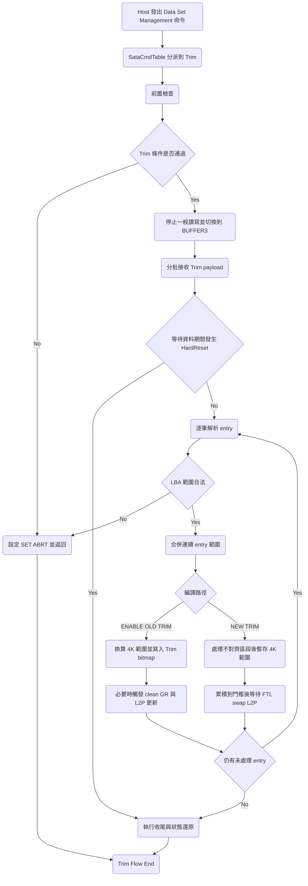

# S11 FTL Trim Flow

## 文件目的
本文件整理 S11 韌體中 Data Set Management Trim 命令主流程，從 `SataCmdTable` 對應到 `Trim` handler，說明前置檢查、主機資料擷取、LBA 範圍整理、對齊處理、以及最後交由 FTL 背景流程落實 Trim。

> 範圍：以 `src/RW.c` 的 `Trim` 主流程為核心，並補充 `ENABLE_OLD_TRIM` 與新流程分支差異。

---

## 1 入口與命令對應

在 `SataCmdTable` 中，ATA `0x06` Data Set Management 會直接呼叫 `Trim`。

進入 `Trim` 後先執行通用 gate：

1. Burner 與 RDT 模式檢查。
2. Write Protect 檢查。
3. 若尚未完成 clean RAM for write done，先呼叫 `ftlClearRAMForGR`。

若任一條件不符，會設定 `gubErrorCode = SET_ABRT` 後返回。

---

## 2 Trim 前置合法性檢查

`Trim` 會檢查下列條件，任何一項失敗都直接 abort：

- `gubTrimSupport` 必須開啟。
- 裝置不可處於 security lock。
- DCO 不可關閉 Trim 功能。
- `HW_FEATURE` bit0 必須為 1。
- `HW_SECTOR_CNT` 需在有效範圍，且不可為 0。
- LBA48 指令支援需開啟。
- sanitize 狀態需允許執行 Trim。

檢查通過後設定 `gubNeedChkDoneTag = 1`，接著進入 Trim 資料處理流程。

---

## 3 主機資料接收與 entry 解析

Trim payload 由 host 傳入，每個 entry 為 8 bytes，內容包含起始 LBA 與 sector count。

主要步驟如下：

1. 呼叫 `HandleStopRW`，暫停一般讀寫節奏。
2. 暫時關閉 `H_DDT_EN` 與 `H_WR_BLK_EN`，避免 Trim 資料搬運受原本傳輸模式干擾。
3. 將 host buffer 切到 `BUFFER3`，使用 `HL_BUF_TRG_SEC` 分批拉資料。
4. polling `HL_CMD_REMAIN_SEC` 等待本批資料到齊，若途中 `gubHardReset` 則直接收尾返回。
5. 逐筆解碼 entry，取出 `uoTrimLBA_Entry` 與 `uwTrimSecCnt_Entry`。
6. 連續 LBA entry 會合併成同一段 Trim 範圍，減少後續處理次數。
7. 若 entry 超出 `gulMediaSize.All` 且 sector count 非零，走 fail path。

---

## 4 對齊與 Trim 資訊落地

Trim 實作分成兩條路徑。

### 4 1 `ENABLE_OLD_TRIM` 路徑

- 以 4K 為基本單位換算 `ulTrimStart4kIndex` 與 `ulTrimEnd4kIndex`。
- 僅把可對齊到 `guw4KEntrysPerTrimbit` 的範圍寫進 `gubTrimTable` bitmap。
- 尾端不足一個 trimbit 粒度的部分，暫存到
  `gulTrimRemainderStartLCA`、`guwTrimRemainder4KNum`、`guwTrimRemainderSectorCnt`，等下一筆可連續命令再合併。
- 收尾時若條件允許，會進一步觸發 `ftlCleanGRTable` 迴圈，把 Trim 標記反映到 GR 與 L2P 相關狀態。

### 4 2 非 `ENABLE_OLD_TRIM` 路徑

- 對齊前後兩端若非 4K 邊界，透過 `Zero` 先處理不對齊區段。
- 對齊後區段記錄到 `gulTrimStart4kIndex` 與 `gulTrimEnd4kIndex` 陣列。
- 當累積到 `D_TRIM_TABLE_NUMBER` 或函式收尾時，統計受影響 L2P group 數量。
- 設定 `gubWaitFTLtoSwapL2P`，由背景 FTL task swap L2P 並完成實際 Trim 作用。

---

## 5 收尾與狀態復原

無論成功或失敗，`Trim` 最後都會做一致的收尾動作：

1. 還原 host buffer 設定回 `BUFFER2`。
2. 還原 `HB_FLAG_CTRL` 與 `HW_AUTO_FIS_CTRL`。
3. 清理 `gulSATA_MSG_TYPE3` 相關狀態。
4. 非 hard reset 情況下執行 `M_SetFlagSettingSHF` 與 `M_CheckDoneTag`。

此設計確保 Trim 中斷或異常後，不會污染下一筆 host command 的資料通道狀態。

---

## 6 何時回傳 Trim 結果給 host

Trim 對 host 的完成回覆屬於同步完成模型，時機點在 `Trim` handler 收尾階段：

1. 先完成本次命令需要的解析與必要同步等待。
2. 非 hard reset 情境下會呼叫 `M_CheckDoneTag`，確認傳輸與狀態收斂。
3. 等待 `HL_AXI_FIS_STAT` 對應狀態清除後，還原控制暫存器並返回。

在非 `ENABLE_OLD_TRIM` 路徑中，程式會在 `gubWaitFTLtoSwapL2P` 變成零前持續 `M_SwitchTask`，也就是會等待 FTL 側完成這一批 Trim 所需的 L2P swap 更新，再結束當前 host Trim 命令。

對 `ENABLE_OLD_TRIM` 路徑而言，流程同樣在函式尾端做 done 檢查與狀態還原，且在條件允許時會先進行一段 clean GR 迴圈後才返回。

---

## 7 Trim 後續背景流程

Trim 並非只在 host handler 內完成所有資料結構更新，後續仍有 FTL task 參與：

1. `gubWaitFTLtoSwapL2P` 由 host 路徑設置後，FTL 主循環會優先進入 `TrimInFtl`。
2. 進入前若判定目前寫入模式 table 壓力高或 GR temp 狀態特殊，會先設定 `gubNeedFlushL2PInTrim`，必要時先做 guarantee flush。
3. `TrimInFtl` 會逐段處理 `gulTrimStart4kIndex` 到 `gulTrimEnd4kIndex`，更新 L2P 映射、invalid 舊 entry，並同步相關計數與狀態。
4. 完成後 FTL 端清掉 `gubWaitFTLtoSwapL2P` 與 `gubNeedFlushL2PInTrim`，host 端等待迴圈才會放行。

整體上是「host 收集範圍與發起」加上「FTL 背景執行 table 變更」的協作模型。

---

## 8 與 GC 及 Read 或 Write 流程的配合機制

Trim 與其他流程的衝突控制主要靠任務節流與旗標協調。

### 8 1 與 Read 或 Write 的配合

- Trim 進入時先 `HandleStopRW(0)`，先收斂讀寫活動再處理 payload。
- Trim 期間會切換 host buffer 到 `BUFFER3`，收尾再還原到一般 RW 使用的 `BUFFER2`。
- 非 `ENABLE_OLD_TRIM` 路徑中，host 端會等待 `gubWaitFTLtoSwapL2P` 歸零，避免 Trim table 更新未完成就讓後續命令以舊映射執行。

### 8 2 與 GC 或 BG 的配合

- FTL 主循環中，`gubWaitFTLtoSwapL2P` 分支在 BG 流程前就會被處理，代表 Trim 的 table swap 有明確優先序。
- 若 Trim 需要額外 flush（`gubNeedFlushL2PInTrim`），會先做 L2P flush 或 guarantee flush，再進 `TrimInFtl`，減少與 GC table 狀態衝突風險。
- `TrimAll` 類路徑會拉高 `gubCleanGRInTrimAll`，FTL 側也用此旗標與 BG 清理流程互斥協調。

因此 Trim 與 GC 並非完全平行，而是透過旗標把關、先後次序與必要 flush 來避免同時改動相依表格。

---

## Trim Flow Mermaid 圖

---

## 備註

- `Trim` 會先把命令描述轉成內部 4K 粒度資訊，真正資料結構更新由 FTL 背景流程完成。
- 舊流程偏向 bitmap 標記與 remainder 合併，新流程偏向批次化的 L2P group swap。
- 若後續要補 `TrimAll` 文件，可沿用本模板，再加上全盤掃描與 sanitize 互斥邏輯。
