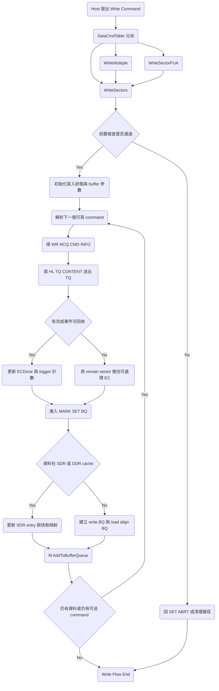

# S11 FTL Write Flow

## 文件目的
本文件整理 S11 韌體中 Host Write 主流程，從 ATA command mapping 進入 `WriteSectors`，說明寫入路徑如何處理 NCQ 與 non NCQ、如何送出 TQ、如何把主機資料轉成 BQ 交給 FTL，最後補上完成回收與異常清理路徑。

> 範圍：以 `WriteSectors` 主流程為核心，`WriteMultiple` 與 `WriteSectorFUA` 會在前段導向同一路徑。

---

## 1 入口與 command 對應

在 `SataCmdTable` 中，常見寫命令對應如下：

- `0x30` `0x34` `0x35` `0x38` `0x61` `0xCA` `0xCB` 導向 `WriteSectors`
- `0x39` `0xC5` 導向 `WriteMultiple`，通過檢查後再呼叫 `WriteSectors`
- `0x3D` `0xCE` 導向 `WriteSectorFUA`，會暫時關閉 write cache 再呼叫 `WriteSectors`

`WriteMultiple` 主要檢查 multi mode enable、LBA48 與 sanitize 狀態；`WriteSectorFUA` 主要檢查 FUA capability 與安全狀態。前置條件不符時會回 `SET_ABRT`。

---

## 2 WriteSectors 前置檢查與初始化

`WriteSectors` 進入後先做幾個 gate：

1. RDT 與 burner mode gate。
2. write protect gate，特定情況直接回 `SET_ABRT`。
3. command 合法性檢查，包含 security lock、NCQ capability、LBA48 capability、sanitize 狀態、CFAST 限制。
4. 若偵測 `gubNCQINTRError` 或 hard reset 或 link lost，會把 `gubNeedChkDoneTag` 設為零並跳去清理路徑。
5. 初始化寫入狀態，像是 `H_TQ_BY_ORDER`、buffer mask、pre read 清理、硬體 D2H SDB 開關。

這一段也會依 DDR mode 決定寫入 buffer 區域，並處理可能殘留的 pre read 旗標，避免讀寫流程互相干擾。

---

## 3 建立 write command 資訊與送出 TQ

主迴圈會反覆挑選下一筆可送出的 write command，核心流程如下：

1. 讀取 `HL_WR_NCQ_INFO` 判斷下一個可寫 tag。
2. 依 NCQ 或 non NCQ 來源建立 `WR_NCQ_CMD_INFO`，內容包含 LBA、sector count、buffer pointer、EC 數量與 trigger time。
3. 檢查 LBA 越界與 overlap，必要時切換順序策略。
4. 透過 `HL_TQ_CONTENT` 送出 TQ，並更新 `gulNCQWRCmdTriggerCnt`。
5. 若寫入資料量很大或 buffer window 不足，會走 multi trigger 讓同一命令分批送出。

這個階段的重點是先把 host data 傳輸要求送進硬體，再等待 done tag 或 message 更新，確認哪些 EC 已可下放到 BQ。

---

## 4 完成回收與 BQ 建立

`WriteSectors` 在執行中會同時做兩件事：

- 回收主機傳輸完成事件
- 把已就緒的資料轉成 BQ 交給 FTL

### 4 1 完成回收

當 `SATAB_RD_CNT` 有 done tag 時，流程會：

1. 取出完成 tag。
2. 依 `WR_NCQ_CMD_INFO` 計算目前可處理的 LBA 範圍與剩餘 sector。
3. 更新 `uwEC_BQDone` 與 `gulNCQWRCmdTriggerCnt`。
4. 若偵測 timeout 或異常，記錄 fail log。

若沒有 done tag，也會用 remain sector 與目前 tag 狀態推估可處理 EC，逐步把 `uwEC_BQDone` 往前推進。

### 4 2 建立 BQ

進入 `MARK_SET_BQ` 後，會把可處理區段切成 BQ：

1. 先算本段 `ulTriggerSectorCnt`、`ub4kNum`、`ulDataMask`。
2. 若在 SDR 或 DDR cache 路徑，更新 `SDR_DataEntryTable` 與 DataCache L2P 映射。
3. 若走 write buffer 路徑，建立 `BQ` 欄位，例如 `ulVir4kIndex`、`ulDataMask`、`uwBufferIndex`、`ub4kNum`、`btNeedLoadAlign`、`ubZcode`。
4. 呼叫 `M_AddToBufferQueue` 把 BQ 推到後端 FTL pipeline。

遇到非 4K 對齊寫入時，可能先建立 load align BQ，再建立正式 write BQ，確保部份資料與 plane 對齊條件正確。

---

## 5 收尾與異常清理

正常路徑下，流程會持續在 TQ 與 BQ 之間循環，直到資料都送完並且 trigger 計數歸零。

若 `gubNeedChkDoneTag` 變成零或發生強制中止，會進入 `Discard_Redundant_NCQWCMD` 類型清理，主要動作包含：

- 將各 tag 的 `uwEC_BQDone` 補到完成狀態
- 清除 `gulNCQWRCmdTriggerCnt` 與除錯追蹤旗標
- 重置 multi trigger 與 last done tag 追蹤
- 視情況回報 abort error

最後回到命令主循環，等待下一筆 host command。

---

## Write Flow Mermaid 圖

---

## 備註

- 本文件聚焦在控制流與 queue 互動，協助快速對照 command 進來後的資料路徑。
- 後續若要補 trim 或 flush 細節，可沿用同樣模板，補上入口檢查、主循環、完成回收、異常處理四段。
